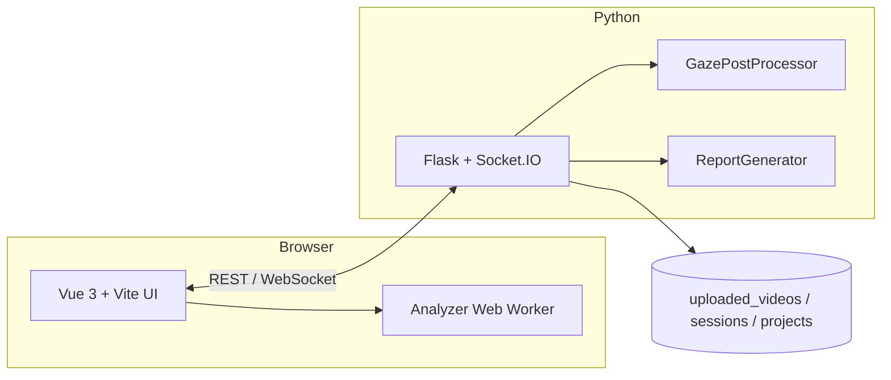

# Architecture

SOROT is a web application for defining **regions of interest (ROIs)** on advertisement or stimulus videos, aligning **eye-gaze** data with those ROIs, and exporting metrics for neuromarketing / vision research.

## Components

| Layer | Technology | Role |
|-------|------------|------|
| UI | Vue 3, TypeScript, Tailwind, Pinia | Video playback, ROI editor, gaze import, workspace save/load |
| Real-time | Socket.IO | Live gaze streaming during recording sessions |
| API | Flask (`sorot.py`) | Uploads, workspace persistence, post-processing, reports |
| Analysis | OpenCV, NumPy, Pandas | Server-side gaze post-processing and validation |
| Optional | OBS WebSocket, yt-dlp | Live capture and YouTube stimulus download |

## User interface

| Mode | How to run | URL |
|------|------------|-----|
| **Development** | `.\dev.ps1` or `npm run dev:all` in `frontend/` | http://localhost:5173 (Vite → proxies to Flask :5000) |
| **Production / Docker** | `npm run build` then `python sorot.py`, or `docker compose up` | http://localhost:5000 (Flask serves `static/dist/`) |
| **Legacy (archived)** | Flask backend only | http://localhost:5000/legacy/ |

The Vue app is the only supported surface for new features. See `legacy/README.md` for the old CDN-Vue stack.

## Data on disk

| Directory | Gitignored | Contents |
|-----------|------------|----------|
| `uploaded_videos/` | Yes | User-uploaded stimulus files |
| `downloaded_videos/` | Yes | yt-dlp downloads |
| `sessions/` | Yes | Per-session gaze recordings and exports |
| `projects/` | Mostly | Workspace JSON (see `example.workspace.json`) |

## Further reading

- [Development setup](development.md)
- [Socket.IO production](socketio-production.md)
